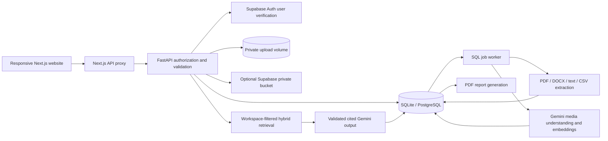
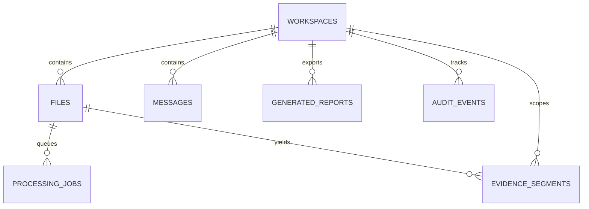

# Architecture

Processing flow: upload signature/size validation → private storage → SQL job → lease claim → extraction → sentence chunking → optional embeddings → source-linked segments → Indexed → Ready or Partially Processed. Errors become Failed; retry replaces prior segments transactionally. A stale processing lease is recovered after 15 minutes.

Entities/relationships and timeline events are derived from evidence segments; citations and validated reasoning are persisted on messages. Embeddings are stored with segments as JSON. User identities come from Supabase rather than custom password records. Optional policies prevent direct frontend database reads. The implemented schema intentionally omits separate duplicated content, entity and conversation tables at MVP scale.
